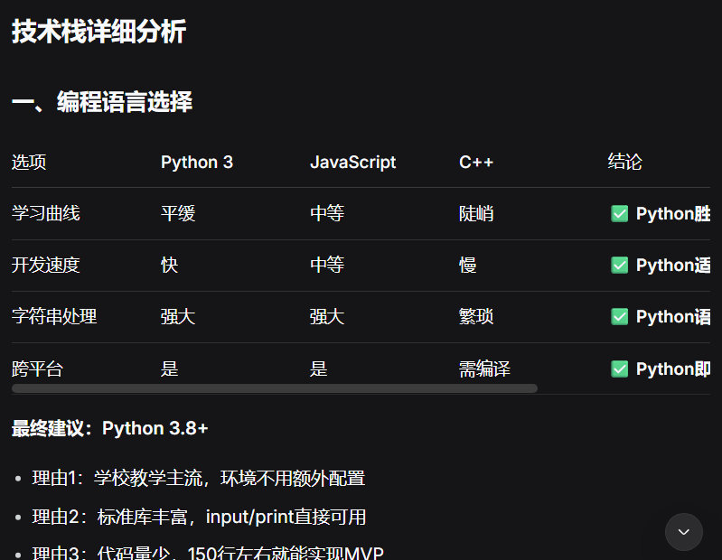

# <center>AI 辅助分析备忘录</center>

## 项目信息

- **项目名称**：走迷宫游戏（Maze Game）
- **分析日期**：2026年3月16日
- **AI工具**：Qwen Code

------

## 技术栈建议

| 维度     | AI建议                                         | 理由                                   |
| :------- | :--------------------------------------------- | :------------------------------------- |
| 编程语言 | Python 3                                       | 语法简单，字符串处理强，适合控制台程序 |
| 代码组织 | 模块化：main.py, map.py, player.py, command.py | 功能分离，便于团队分工                 |
| 数据存储 | 内存中的列表/字典                              | MVP无需持久化，简单够用                |
| 输入处理 | `input()` + `.lower().strip()`                 | 标准化处理，避免大小写和空格问题       |

------

## 关键卡点（容易踩坑的地方）

| 卡点     | 具体问题                         | AI建议的解决方案                              |
| :------- | :------------------------------- | :-------------------------------------------- |
| 输入处理 | 大小写混用、空格、空输入导致崩溃 | 统一用 `.lower().strip()`，空输入时跳过       |
| 边界溢出 | 移动到地图外导致列表索引错误     | 移动前检查 `0 <= x < 宽度` 和 `0 <= y < 高度` |
| 撞墙检测 | 玩家走进 `#` 符号                | 封装 `can_move()` 函数统一判断                |
| 状态同步 | 物品被拾取后地图上还在           | 拾取后把地图格子改成地板 `.`                  |
| 硬编码   | 地图符号散落在代码各处           | 用 `constants.py` 集中管理：`WALL='#'` 等     |

------

## 系统边界

###  MVP必须包含（Sprint 1做）

- 固定地图（至少5x5）
- 移动：wasd四个方向
- 碰撞检测：不能穿墙、不能出界
- 物品拾取：走到K自动捡起
- 胜利条件：走到G获胜
- 基本命令：help, inventory, quit

###  绝对不做（超出纯控制台边界）

- 图形界面
- 网络联机
- 鼠标交互
- 声音/音乐

### 可以延后（Sprint 2再做）

- 随机地图生成
- 多关卡
- 门和钥匙机制
- 敌人/战斗

------

##  AI对谈记录

### 对话1

#### 问题1

```
我正在开发一个纯控制台的走迷宫游戏，用Python。请从专业角度详细分析推荐的技术栈，包括语言版本、代码架构、数据存储方案、输入输出处理方式，并说明每个选择的理由。
```

#### 回答1（只截取部分）



### 对话2

#### 问题2

```
请详细分析用Python开发纯控制台走迷宫游戏可能遇到的关键卡点和技术难点。每个卡点要说明具体表现、产生原因、解决方案和代码示例。要涵盖输入处理、地图逻辑、状态管理、用户体验等方面。
```

#### 回答2（只截取部分）


### 对话3

#### 问题3

```
请详细分析用Python开发纯控制台走迷宫游戏的系统边界划分。要明确三个层次：MVP必须包含的核心功能、可以延后到Sprint 2的增强功能、绝对不能做的越界功能。每个功能要说明具体内容和划分理由。
```

#### 回答3（只截取部分）


